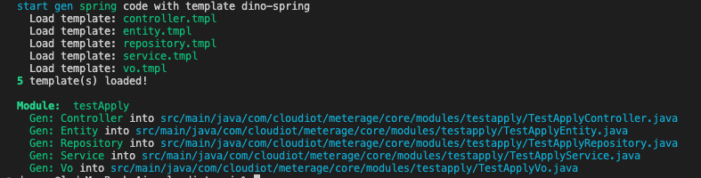

# 🦖 Dino Cli
<div align="center">
<div></div>

<hr height="1" style="height: 1px; border-width: 0px 0 0 0 !important;"/>

Dino Cli 用于代码生成 · 工程创建。
</div>

---

## 介绍
  Dino Cli是基于Node.js开发的命令行工具，用于帮助更快的完成基于Dino Spring和Dino Vue3前后端开发。

  其功能涵盖：工程创建，代码生成，基于UI的快速开发，代码模板开发。

> **Warning**
>  Dino Cli处于开发阶段，命令参数和执行逻辑可能会发生变化，请随时关注本文档。


## 开发动机
  Dino Cli是Dino开发框架的一部分，和框架的目的一致，都是为了减少重复代码书写，提升开发速度，提高开发质量。

  在项目开发中，大量模块是有着类似的结构的，通过Dino Cli的代码生成功能，可以用更短的时间完成项目功能的开发，避免大量的Ctrl+C/V的使用，也能更好提高代码的可维护性。

## 快速开始

安装：
```shell
npm install -g @dino-dev/cli
# OR
yarn global add @dino-dev/cli

# check install
dino --version
# @dino/cli x.x.x
```

代码生成：
```shell
dino code test-apply

# output as follow ↓↓↓
```



## 详细文档

https://dinodev.cn/dino-cli/

## 📄 License

dino-cli is an open source software licensed as [Apache-2.0](./LICENSE).
